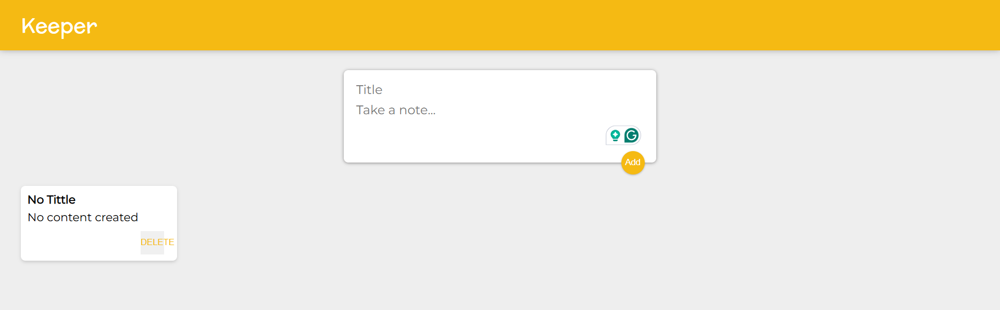

# Hi there, I'm [Jamiu]! 👋

## About Me 🚀

I'm a passionate **Software Engineer** with experience in **HTML, CSS, Javascript, and React**. I love tackling complex problems, learning new skills, and collaborating with diverse teams to create innovative solutions.

- 🌱 Currently learning: **[Next, Typescript, and React Native]**
- 🔭 Working on: **[Airbnb Project]**
- 🌍 Languages: **[Python, Javascript, and English]**
- 📫 How to reach me: **[sbmjamiu@gmail.com]**
- ⚡ Fun fact: **[I am a Nigeria and love travelling]**

## My Skills 🧠

## Featured Projects 💻

### [Keeper](https://pogqj.csb.app)

**Keeper** is an **app that allows you take notes, edit and delete it** built with **React**. This project showcases my skills in **Mapping data to components, styling React, changing complex state, and managing component trees**. You can check out the repository [here](https://github.com/sbmjamiu/Keeper).

### [Fyyur](project_1_link)

**[Fyyur]** is a **[musical venue and artist booking site ]** built with **[Flask and PostgreSQL]**. This project demonstrates my ability to **[ build out the data models to power the API endpoints and use database for storing, querying, and creating information]**. You can check out the repository [here](https://github.com/sbmjamiu/FyyurProject).

## Get in Touch 📬

- **[LinkedIn]**(www.linkedin.com/in/jamiu-olaniyan-abdulhakeem)
- **[Twitter]**(https://x.com/sbm_jamiu)

